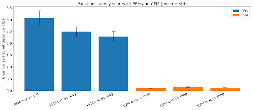

# PFM-ExtraMaterial

Anonymous repository meant to give access to figures not easily accessible on Open Review for Product Flow Matching (PFM).

 **(1) Quantitative experiment for commutativity of PFM using FID, comparison with CFM:**
 

  

Same results in a table: 

  
| Method | Path 1: t→s | Path 2: s→t | Path 3: Diagonal |
|--------|-------------|-------------|------------------|
| PFM    | 3.0832 ± 0.3006 | 2.4917 ± 0.2186 |2.2869 ± 0.2156|                 -
| CFM   |0.1025 ± 0.0065|0.1477 ± 0.0199|0.1274 ± 0.0125|

